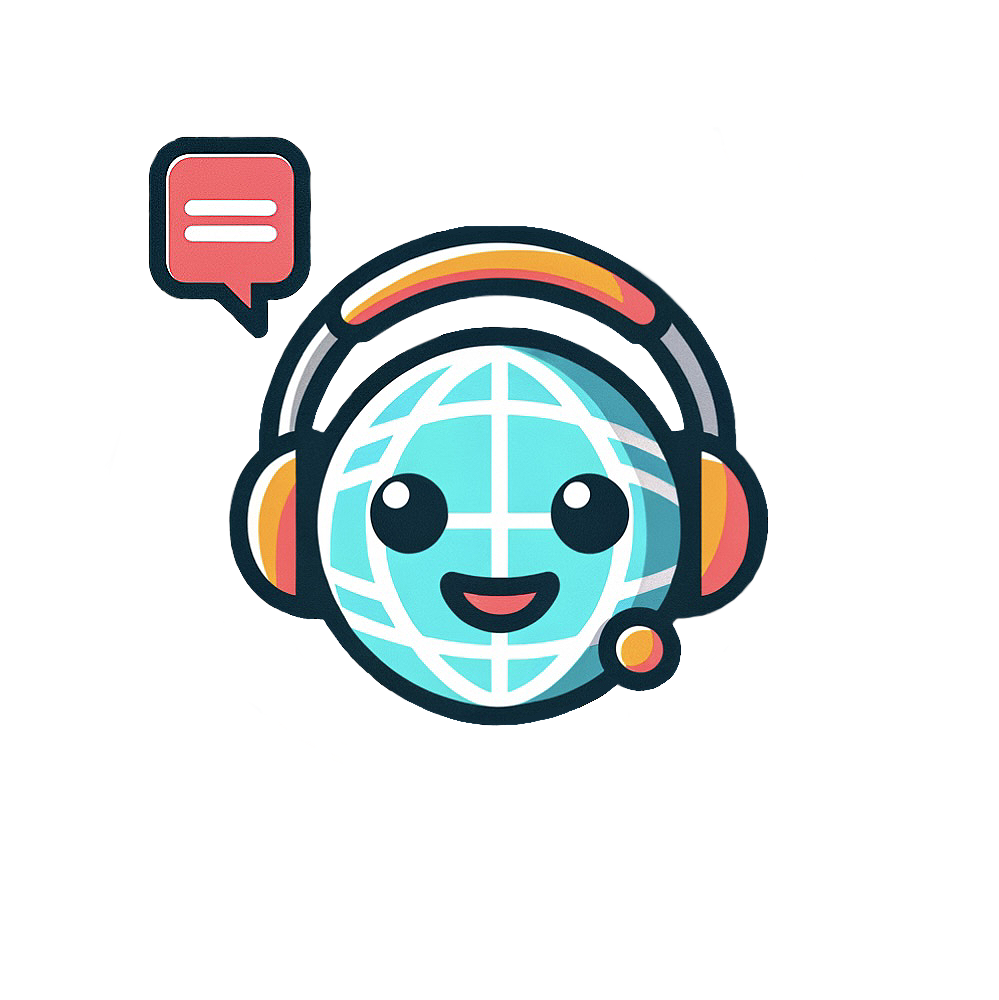

  
# Polyglot

        

## Overview

Polyglot is an initiative to close the linguistic divide in NLP by developing efficient and accessible foundation models for low-resource languages. We address this imbalance by creating tools, models, and datasets that support open, sustainable, and inclusive AI development.

* The source code used for the developemnt of our models and datasets: https://github.com/Polygl0t/llm-foundry
* Our fork of the EleutherAI/lm-evaluation-harness. All evaluations we use are integrated into this fork: https://github.com/Polygl0t/lm-evaluation-harness
* All our releases are available at https://huggingface.co/Polygl0t

## Aknowlegments

Polyglot is a project funded by the Federal Ministry of Education and Research (BMBF) and the Ministry of Culture and Science of the State of North Rhine-Westphalia (MWK) as part of TRA Sustainable Futures (University of Bonn) and the Excellence Strategy of the federal and state governments.

We also gratefully acknowledge access to the Marvin cluster, hosted by the University of Bonn, along with support from its High Performance Computing & Analytics Lab.

